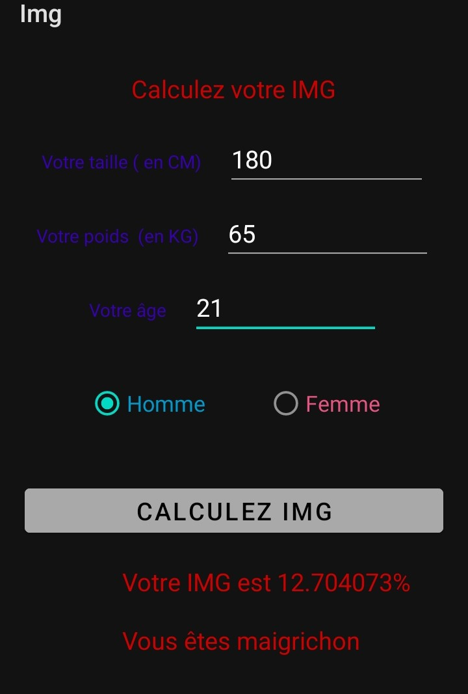

# TP2
#Réalisé par Emmanuel Levy MBINA
#Created by Emmanuel Levy MBINA

L'indice de masse grasse ou IMG est un indicateur plus récent que l'indice de masse corporelle (IMC). 
Il permet d'évaluer la proportion de masse graisseuse d'une personne.
Il prend en compte l'âge , le sexe de l'individu et l'IMC de l'individu.
Nous avons mis au point une application qui permet de calculer l'IMG, suivant la formule.

IMG (%) = (1.20∗ IMC) + (0.23∗Age) − (10.8∗Sexe) − 5.4 
Ceci pour les personnes âgées de 16 ans ou plus, la valeur Sexe prend 0 pour les femmes et 1 pour les hommes.

IMG (%) = (1.51∗IMC) + (0.70∗Age) − (3.6∗Sexe) + 1.4 
Ceci pour les individus de moins de 15 ans, la valeur Sexe prend 0 pour les femmes et 1 pour les hommes.

L'utilisateur rentre ses informations:
-Son poids.
-Sa taille
-Son âge 
-Son sexe
L'application calcule d'abord son IMC , puis son IMG et lui fournit un interpretation.

The fat mass index or IMG is a more recent indicator than the body mass index (BMI).
It makes it possible to evaluate the proportion of fat mass of a person.
It takes into account the age, the sex of the individual and the BMI of the individual.
We have developed an application that calculates the IMG, following the formula.

IMG (%) = (1.20∗ IMC) + (0.23∗Age) − (10.8∗Sexe) − 5.4 
This for people aged 16 or over, the Gender value takes 0 for women and 1 for men.

IMG (%) = (1.51∗IMC) + (0.70∗Age) − (3.6∗Sexe) + 1.4 
This for people aged 15 or under, the Gender value takes 0 for women and 1 for men.

The user enters his information:
-His weight.
-Her size
-His age
-His gender
The application first calculates his BMI, then his IMG and provides an interpretation.

